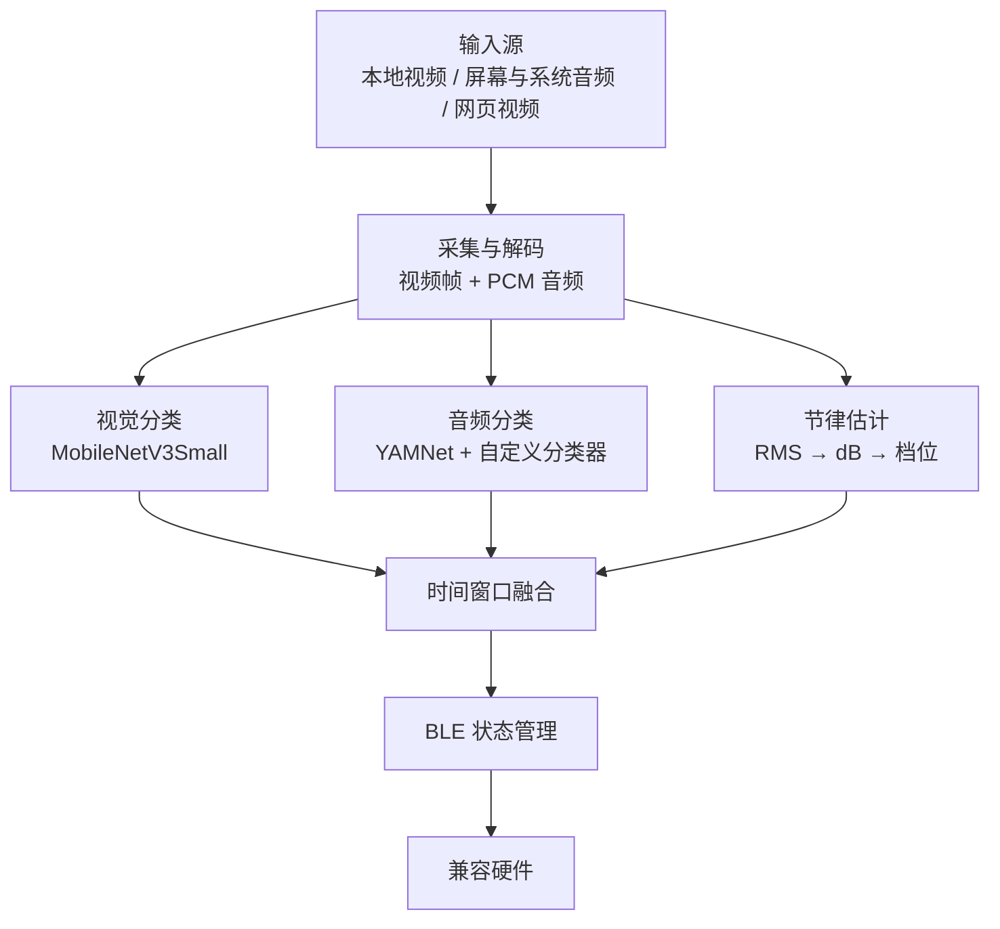

# Xcup Android

一个运行在 Android 端的实时视频理解与 BLE 联动项目。

Xcup Android 会从本地视频、屏幕共享或网页视频中提取画面与音频，在设备端识别动作状态和节律强度，经过时间窗口平滑与状态管理后，将控制指令发送给兼容的 BLE 硬件。

本项目最初作为个人项目开发。随着类似的视频互动能力逐渐普及，我决定公开代码，供对 Android 多媒体处理、端侧多模态推理和 BLE 实时控制感兴趣的开发者学习、研究与二次开发。

> 本项目涉及成人内容识别场景，仅面向成年人。请在遵守当地法律、内容授权、隐私保护和第三方平台规则的前提下使用。

## 功能概览

- 本地视频分析：从系统文件选择器导入视频，播放过程中同步分析画面与音频。
- 在线分析：通过 `MediaProjection` 和 `AudioPlaybackCapture` 获取屏幕画面及其他应用允许捕获的播放音频。
- 网页视频模式：使用应用内 `WebView` 获取页面信息，并将识别到的 MP4/HLS 媒体交给 ExoPlayer 播放与分析。
- 端侧视觉推理：使用 MobileNetV3Small TFLite 模型识别剧情、口部动作和性交动作三类画面。
- 端侧音频推理：使用 YAMNet 与自定义分类器识别动作类别。
- 节律强度估计：根据 PCM 音频的 RMS、dB、时间平滑和置信度生成离散档位。
- 多模态融合：对近期音频与视频结果进行加权、过滤和时间窗口平滑，降低单帧误判与状态抖动。
- BLE 控制：支持自动扫描、连接、指令发送、发送节流，以及硬件按键触发后的暂停与恢复。
- 播放同步：支持拖动、暂停、恢复、播放结束处理和横屏全屏；Seek 后会重置历史状态并重新同步分析链路。
- 应用更新检查：通过远端 `version.json` 判断推荐更新或强制更新，并跳转外部浏览器下载。

## 工作原理



系统主要由三个并行工作链路组成：

1. 视频链路按播放时间提取帧，维护 12 帧时序窗口，并周期性执行 MobileNetV3Small 推理。
2. 音频链路把音频统一重采样为 16 kHz，从环形缓冲区读取最近约 2 秒的 PCM 数据并执行 YAMNet 推理，同时估计节律强度。
3. 融合链路周期性读取最新结果，过滤过期数据，通过加权时间窗口生成最终动作与档位，再交给 BLE 状态管理器发送。

所有模型推理和音频解码均在后台线程完成；线程之间主要使用 `AtomicReference`、`AtomicBoolean` 和同步块交换状态。

## 核心组件

| 组件 | 作用 |
| --- | --- |
| `MainActivity.java` | 主界面、视频选择、BLE 连接、在线分析入口和更新检查 |
| `VideoProcessActivity.java` | 本地视频播放、音视频分析、结果融合和 BLE 控制 |
| `OnlineAnalysisActivity.java` | 在线分析界面，复用本地模式的推理与融合逻辑 |
| `OnlineAnalysisService.java` | 前台服务；负责屏幕捕获、系统音频采集、静音检测和数据回调 |
| `VideoFrameExtractor.java` | 基于 MediaExtractor、MediaCodec 与 SurfaceTexture 解码视频帧 |
| `EGLRenderer.java` | 使用 OpenGL/EGL 将 SurfaceTexture 内容读取为 Bitmap |
| `VideoClassifierHelper.java` | MobileNetV3Small TFLite 推理封装 |
| `AudioDecoder.java` | 按播放进度解码、重采样音频并写入 PCM 环形缓冲区 |
| `PcmCircularBuffer.java` | 管理本地与在线模式的 PCM 数据写入和窗口读取 |
| `AudioInferenceHelper.java` | YAMNet 特征提取与自定义音频分类器推理 |
| `AudioLoudnessLevelEstimator.java` | 音频响度、时间平滑、置信度与离散档位估计 |
| `BLEManager.java` | BLE 扫描、连接、协议帧编解码与控制状态管理 |
| `UpdateChecker.java` | 拉取版本配置并判断推荐更新或强制更新 |

## 模型规格

### 视频模型

- 骨干网络：MobileNetV3Small + Temporal Average Pooling + 三分类器
- 模型文件：`mobilenetv3small_tap_3class_float32.tflite`
- 输入：`[1, 12, 160, 160, 3]`，`float32`，NHWC，RGB
- 像素范围：`0-255`，模型内部包含 Rescaling，不应再次归一化
- 输出：`normal_plot`、`oral`、`sex` 三类 softmax 概率
- 推理配置：CPU，4 线程

### 音频模型

- 特征提取：预训练 YAMNet
- 分类器：面向当前任务微调的三分类模型
- 输入：2 秒、16 kHz、单声道 PCM，共 32,000 个 `float` 采样点
- 输出：动作类别、置信度与时间戳

第三方预训练模型与相关资源仍受各自许可证和使用条款约束。自定义模型是否随仓库提供，请以 `app/src/main/assets/` 中的实际文件为准。

## 开始使用

### 环境要求

- Android Studio 与项目所需 Android SDK
- 支持 BLE 的 Android 真机
- 在线屏幕与系统音频分析建议使用 Android 10 或更高版本
- 与项目配置一致的 Gradle/JDK 版本
- 与目标硬件一致的 BLE 服务和特征 UUID

模拟器通常无法完整验证 BLE、屏幕投影、系统播放音频捕获和实际性能，建议使用真机调试。

### 1. 获取代码

将本仓库克隆或下载到本地，然后使用 Android Studio 打开项目根目录。

### 2. 准备模型

确认推理所需的 TFLite 模型已放入：

```text
app/src/main/assets/
```

至少应检查视频模型、YAMNet 和自定义音频分类器的文件名是否与代码中的加载路径一致。

### 3. 配置 BLE

在 `BLEManager.java` 或对应配置文件中填写实际硬件参数：

- `TARGET_NAME_PREFIX`
- Service UUID
- Characteristic UUID
- 指令帧格式与档位映射

仓库中的默认值未必适用于其他硬件。错误的协议、方向或档位映射可能导致设备行为异常，请先在低强度和空载状态下测试。

### 4. 配置更新地址（可选）

如需启用应用更新检查，请将固定地址的 `version.json` 配置为类似结构：

```json
{
  "latestVersionCode": 108,
  "minSupportedCode": 106,
  "latestVersionName": "1.0.8",
  "landingUrl": "https://example.com/download",
  "notes": "Bug fixes and performance improvements"
}
```

### 5. 构建与安装

在 Android Studio 中完成 Gradle Sync 后运行 `app`，或在仓库包含 Gradle Wrapper 时执行：

```bash
./gradlew assembleDebug
```

首次使用时，根据 Android 版本授予蓝牙、通知、录音和屏幕投影等必要权限。

## 使用流程

### 本地视频

1. 在主界面连接 BLE 设备。
2. 选择本地视频文件。
3. 播放视频，应用会自动启动音视频分析与 BLE 联动。
4. 暂停、拖动或退出播放时，应用会暂停分析并发送停止状态；恢复后重新同步。

### 在线分析

1. 进入在线分析模式并授权屏幕捕获。
2. 返回桌面，在其他应用中播放允许捕获的视频。
3. 应用以前台服务持续获取屏幕帧和系统音频。
4. 连续静音达到阈值时，分析和硬件动作会暂停。

### 网页视频

1. 在应用内网页模式打开页面。
2. 播放目标视频，等待应用识别 MP4 或 HLS 媒体资源。
3. 将识别到的媒体交给 ExoPlayer 后开始统一的播放、Seek 与分析流程。

## 性能参考

以下为开发阶段的单次测试结果，仅用于说明量级；不同 SoC、Android 版本、视频分辨率和温控状态会显著影响结果。

| 项目 | 参考耗时 |
| --- | ---: |
| 视频帧提取 | 约 43.54 ms |
| MobileNetV3Small 推理 | 约 110 ms |
| 视频抽帧到推理完成 | 约 154 ms |
| YAMNet 音频推理 | 约 65 ms |
| 音频节律估计 | 约 3 ms |

## 已知限制

- `AudioPlaybackCapture` 只能捕获目标应用明确允许捕获的音频；受保护内容可能静音或黑屏。
- DRM、临时签名 URL、非标准媒体清单、反自动化机制和页面结构变化可能导致网页媒体识别失败。
- 网页模式不应用于绕过 DRM、付费墙、访问控制或第三方服务的安全机制。
- BLE 协议和档位映射与具体硬件绑定，不能直接保证兼容其他设备。
- 分类结果依赖训练数据分布，不应将模型输出视为对内容的绝对判断。
- 当前性能数据来自开发阶段测试，不代表所有设备上的实时性或稳定性。

## 隐私与合规

- 音视频识别链路设计为端侧推理；如二次开发中加入日志上传、统计分析或云端推理，应明确告知用户并取得必要授权。
- 仅分析你有权访问和处理的内容，不得处理涉及未成年人、偷拍、胁迫或其他违法内容。
- 屏幕捕获、音频捕获和网页访问应遵守当地法律、内容版权及目标应用/网站的服务条款。
- 接入实体硬件前请增加强度上限、停止指令、连接异常处理和人工中止机制，并充分测试。

## 贡献

欢迎提交 Issue 和 Pull Request。提交改动时建议：

- 说明 Android 版本、设备型号和复现步骤。
- 将站点适配、模型调整、BLE 协议和通用播放器改动拆分为独立提交。
- 不要提交无权公开的视频、音频、训练数据、密钥、签名文件或设备唯一标识。
- 对涉及线程、Seek、暂停恢复或 BLE 状态机的改动补充真机测试结果。

## 许可证

Apache License 2

## 致谢

- [LiteRT / TensorFlow Lite](https://developers.google.com/edge/litert)
- [MobileNetV3Small](https://www.tensorflow.org/api_docs/python/tf/keras/applications/MobileNetV3Small)
- [YAMNet](https://www.tensorflow.org/hub/tutorials/yamnet)
- [Android MediaProjection](https://developer.android.com/media/grow/media-projection)
- [Android Audio Playback Capture](https://developer.android.com/media/platform/av-capture)
- [Android BLE](https://developer.android.com/develop/connectivity/bluetooth/ble/ble-overview)
- [Media3 ExoPlayer](https://developer.android.com/media/media3/exoplayer)

---

如果这个项目对你有帮助，欢迎 Star、提交反馈，或分享你的改进方案。
